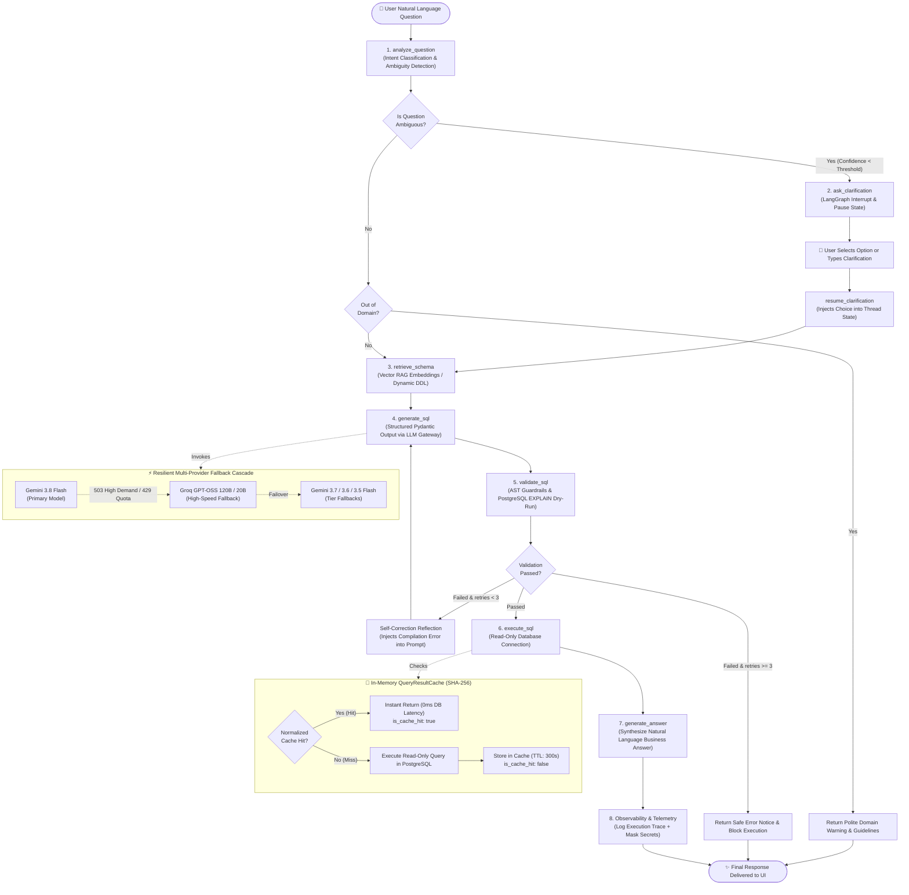

# QueryPilot: Stateful, Cyclic Agentic Text-to-SQL Web Application

<p align="center">
  
  
  
  
  
  
  
  
</p>

---

## 📌 Table of Contents
- [Executive Overview](#-executive-overview)
- [Key Features](#-key-features)
- [Visual LangGraph Cyclic Workflow](#-visual-langgraph-cyclic-workflow)
- [Detailed 7-Layer Agent Architecture](#-detailed-7-layer-agent-architecture)
- [Multi-Model & Multi-Provider Fallback Cascade](#-multi-model--multi-provider-fallback-cascade)
- [In-Memory Caching & Deterministic SHA-256 Keying](#-in-memory-caching--deterministic-sha-256-keying)
- [Dual Database Architecture](#-dual-database-architecture)
- [Security Hardening & Key Management](#-security-hardening--key-management)
- [Observability, Telemetry & Traces](#-observability-telemetry--traces)
- [Step-by-Step Setup & Run Instructions](#-step-by-step-setup--run-instructions)
  - [1. Prerequisites](#1-prerequisites)
  - [2. Environment Configuration](#2-environment-configuration)
  - [3. PostgreSQL Database Initialization](#3-postgresql-database-initialization)
  - [4. Running the Backend (FastAPI)](#4-running-the-backend-fastapi)
  - [5. Running the Frontend (React + Vite)](#5-running-the-frontend-react--vite)
- [Verification & Automated Test Suite](#-verification--automated-test-suite)
- [REST API Reference](#-rest-api-reference)
- [Known Limitations & Roadmap](#-known-limitations--roadmap)

---

## 🚀 Executive Overview

**QueryPilot** is a production-ready, self-correcting agentic Text-to-SQL web application that bridges natural language questions and relational databases. Unlike simplistic one-shot LLM prompts that fail on ambiguous questions, schema drift, or SQL syntax errors, QueryPilot operates as an autonomous, cyclic state machine powered by **LangGraph**.

It mimics the analytical process of an experienced data engineer and DBA:
1. **Understands Intent:** Identifies ambiguous or out-of-domain questions before touching the database.
2. **Clarifies with Humans:** Pauses execution with human-in-the-loop interrupts (`Command(resume=choice)`) when multiple interpretations exist.
3. **Retrieves Schema Knowledge:** Uses vector RAG embeddings for complex schemas and dynamic DDL parsing for custom uploaded datasets.
4. **Generates & Self-Corrects SQL:** Generates PostgreSQL queries, compiling dry-runs with `EXPLAIN` and reflecting on errors through an automatic retry loop (up to 3 attempts).
5. **Zero-Downtime Multi-Model Fallback:** Cascades between **Google Gemini** (primary: `gemini/gemini-3.8-flash`) and **Groq** (`groq/openai/gpt-oss-120b`, `groq/openai/gpt-oss-20b`) plus secondary Gemini tiers (`gemini/gemini-3.7-flash`, `gemini/gemini-3.6-flash`, `gemini/gemini-3.5-flash`) when primary providers experience temporary demand spikes (503) or rate limits (429).
6. **Accelerated Caching:** Employs an in-memory SHA-256 query result cache (`QueryResultCache`) with TTL and whitespace normalization, delivering instant `<1ms` responses on repeated questions.
7. **Synthesizes Business Answers:** Converts query output tables into actionable natural language insights with responsive, glassmorphic UI previews.

---

## 🌟 Key Features

| Feature | Description |
| :--- | :--- |
| 🔄 **Cyclic Self-Correction** | If an `EXPLAIN` compilation fails, the database compiler error is fed back to the LLM for iterative reflection and repair (up to 3 attempts). |
| 🛑 **Human-in-the-Loop Clarification** | Uses LangGraph `interrupt()` to present multiple-choice ambiguities directly in the UI before executing. |
| ⚡ **Multi-Model Fallback Cascade** | Automatically recovers from Gemini `503 Service Unavailable` or `429 Rate Limit` by falling back to Groq (`groq/openai/gpt-oss-120b`, `groq/openai/gpt-oss-20b`) and alternative Gemini tiers (`3.7`, `3.6`, `3.5`). |
| 💾 **Deterministic SHA-256 Caching** | Normalizes SQL comments, whitespace, and casing into a SHA-256 hash. Delivers instant 0ms DB latency on cache hits with dataset-scoped invalidation. |
| 📁 **Custom Dataset Ingestion** | Upload `.csv` or `.xlsx` files up to 10MB. Automatically creates isolated tables (`dataset_<uuid>`) with inferred PostgreSQL types. |
| 🛡️ **Defense-in-Depth Security** | Dedicated read-only PostgreSQL role (`DB_READONLY_USER`), AST regex syntax blockers, multi-statement rejection, and session cookie table isolation. |
| 🔑 **Zero-Trace BYOK** | Bring-Your-Own-Key for Gemini or Groq. Transmitted request-scoped via `RunnableConfig` without ever being saved to database, disk, or traces. |
| 📊 **Full Observability** | Automatic trace logging to `querypilot_traces.jsonl` with regex secret redaction masking keys, tokens, and passwords. |
| 📱 **100% Fully Responsive UI** | Hand-crafted glassmorphism dark theme optimized for mobile (320px+), tablet, desktop, and ultra-wide displays with touch-friendly controls. |

---

## 🔄 Visual LangGraph Cyclic Workflow

The following state machine represents QueryPilot's complete execution lifecycle:



---

## 🧩 Detailed 7-Layer Agent Architecture

### Layer 1: Prompt & Intent Analysis (`analyze_question` in `app/agent/nodes/analyze.py`)
* **Role:** Acts as the entry gatekeeper. Evaluates whether the question can be resolved into a relational query.
* **Output Schema:** Evaluates into a structured `QueryAnalysis` object containing:
  - `is_ambiguous: bool` (Flags missing filters, underspecified timeframes, or unclear metrics).
  - `is_out_of_domain: bool` (Detects off-topic queries like weather forecasts, coding prompts, or recipes).
  - `clarification_question: Optional[str]`
  - `options: List[str]` (Concrete interpretations presented to the user).
  - `intent: Optional[str]` (Core extracted intent).

### Layer 2: Human-in-the-Loop Clarification (`ask_clarification` in `app/agent/nodes/clarify.py`)
* **Role:** Uses LangGraph's stateful checkpointing (`MemorySaver`) to pause thread execution without losing context.
* **Resumption:** When the user selects option `[1]`, `[2]`, or inputs custom clarification text, `/api/query/resume` sends `Command(resume=choice)`, reviving the thread and proceeding immediately to schema retrieval.

### Layer 3: Contextual Schema Retrieval (`retrieve_schema` in `app/agent/nodes/retrieve_schema.py`)
* **Demo Mode:** Uses vector similarity via `gemini-embedding-001` or `text-embedding-004` (in `app/rag/retriever.py`) to retrieve the top 3 most relevant schema cards, preventing context window bloating.
* **Custom Dataset Mode:** Bypasses vector search and injects the dynamic PostgreSQL table DDL inferred directly during file ingestion.

### Layer 4: Schema-Grounded SQL Generation (`generate_sql` in `app/agent/nodes/generate_sql.py`)
* **Role:** Constructs syntactically valid PostgreSQL statements using strictly the provided schema context.
* **Output Schema:** Validates through `SQLGenerationResult`:
  - `sql_query: str` (The raw SQL statement).
  - `reasoning: str` (Step-by-step mathematical logic for JOINs and aggregations).
  - `tables_used: List[str]` (Explicit list of tables for access enforcement).

### Layer 5: AST Guardrails & Compilation Validation (`validate_sql` in `app/agent/nodes/validate_sql.py`)
* **Phase A (Static AST Analysis):** Uses `app/guardrails/sql_guard.py` to reject any query containing forbidden write operations (`INSERT`, `UPDATE`, `DELETE`, `DROP`, `ALTER`, `TRUNCATE`, `GRANT`, `COPY`). Rejects multi-statement semicolons.
* **Phase B (Dynamic Compilation Dry-Run):** Executes `EXPLAIN <query>` against PostgreSQL. Catches syntax errors, non-existent columns, and type mismatches before any data is read.
* **Phase C (Cyclic Reflection):** If validation fails and retry count is under 3, increments `retry_count`, appends the exact database error message to the LLM prompt, and routes back to `generate_sql`.

### Layer 6: Safe Database Execution (`execute_sql` in `app/agent/nodes/execute_sql.py`)
* **Role:** Connects to PostgreSQL using a dedicated read-only role (`DB_READONLY_USER`).
* **Protection:** Enforces statement timeouts and automatically caps returned rows (default: 50 rows) to protect server memory.
* **Performance:** Queries are checked against the normalized in-memory cache (`QueryResultCache`). Cache hits return in `<1ms`.

### Layer 7: Business Answer Synthesis (`generate_answer` in `app/agent/nodes/answer.py`)
* **Role:** Transforms raw result rows into clean, concise, executive-level business answers (e.g., `"Total revenue for Q3 delivered orders was $428,950.00 across 1,240 transactions."`).

---

## ⚡ Multi-Model & Multi-Provider Fallback Cascade

During peak usage, cloud LLMs (such as Google Gemini free tier endpoints) can experience temporary demand spikes:
```
litellm.ServiceUnavailableError: 503 This model is currently experiencing high demand.
```

QueryPilot features an **intelligent multi-provider fallback engine** in [app/llm/gateway.py](file:///c:/Users/Satyam%20Singh/OneDrive/Documents/Desktop/QueryPilot/app/llm/gateway.py) powered by LiteLLM:

```
+------------------------------------+
|  Primary: gemini/gemini-3.8-flash  |
+-----------------+------------------+
                  | (On 503 High Demand / 429 Quota / Server Error)
                  v
+------------------------------------+
|  Fallback 1: groq/openai/          |  <--- Blazing fast throughput, high rate limits
|  gpt-oss-120b & gpt-oss-20b        |
+-----------------+------------------+
                  | (On Failover)
                  v
+------------------------------------+
|  Fallback 2: gemini-3.7-flash,     |
|  gemini-3.6-flash, 3.5-flash       |
+------------------------------------+
```

### Key Capabilities:
1. **Configurable Models:** Configured via `PRIMARY_MODEL` and `FALLBACK_MODELS` in `.env` and `app/core/config.py`.
2. **Automatic Error Detection:** `is_fallback_worthy_error()` intercepts `503 Service Unavailable`, `429 Rate Limit`, and `500 Server Errors` without crashing the user session.
3. **Provider-Aware Key Resolution:** `resolve_api_key_for_model()` automatically sends `GEMINI_API_KEY` to Google models and `GROQ_API_KEY` to Groq endpoints. If the user supplies a Groq BYOK key (`gsk_...`), it is seamlessly routed to Groq while preserving Gemini for vector embeddings.
4. **Structured Output Resiliency:** Includes `_parse_structured_output()` to safely extract JSON payloads even if fallback models wrap responses in Markdown code blocks (` ```json ... ``` `).

---

## 💾 In-Memory Caching & Deterministic SHA-256 Keying

QueryPilot features an enterprise-grade query caching subsystem in [app/core/cache.py](file:///c:/Users/Satyam%20Singh/OneDrive/Documents/Desktop/QueryPilot/app/core/cache.py) (`QueryResultCache`):

### 1. SQL Whitespace & Comment Normalization
Before hashing, queries are normalized using `normalize_sql_for_cache(sql_query)`:
* Strips all single-line comments (`-- comment`).
* Collapses arbitrary whitespace, newlines, and tabs into a single space.
* Strips trailing semicolons and edge padding.
* *Example:*
  ```sql
  -- Look up count
  SELECT   COUNT(*)
  FROM     customers;
  ```
  normalizes deterministically to:
  ```sql
  SELECT COUNT(*) FROM customers
  ```

### 2. Deterministic SHA-256 Cache Key
The cache key incorporates the dataset ID, schema version hash, and normalized SQL:
```python
raw_key = f"{dataset_id or 'demo'}:{schema_hash or 'demo_v1'}:{norm_sql}"
cache_key = hashlib.sha256(raw_key.encode("utf-8")).hexdigest()
```
This guarantees that queries against different datasets or modified schemas **never collide**.

### 3. Lifecycle & Integration:
* **Thread-Safe:** Uses Python's `threading.Lock()` to prevent race conditions during concurrent requests.
* **Time-to-Live (TTL):** Default TTL is **300 seconds (5 minutes)**. Expired entries are evicted on read.
* **No Error Caching:** Queries returning database errors are never cached.
* **Dataset Invalidation:** In [app/services/dataset_service.py](file:///c:/Users/Satyam%20Singh/OneDrive/Documents/Desktop/QueryPilot/app/services/dataset_service.py), whenever a custom dataset is deleted or updated, `query_cache.invalidate_dataset(dataset_id)` immediately purges all associated keys.
* **Telemetry Tracking:** Both `cache_hit: bool` and `cache_miss: bool` are tracked and logged in execution traces.

---

## 🗄️ Dual Database Architecture

QueryPilot seamlessly operates in two operational modes:

### 1. Default E-Commerce Demo Mode
Pre-seeded with a comprehensive retail schema containing 5 interrelated tables:
* `customers`: User profiles, signup dates, loyalty tiers, and country codes.
* `products`: Product catalog, categories, unit prices, and inventory counts.
* `orders`: Order transactions, order dates, total amounts, and statuses (`completed`, `cancelled`, `pending`).
* `order_items`: Line-item details linking orders to products with quantities and unit prices.
* `payments`: Payment transaction logs, payment methods, timestamps, and validation statuses.

### 2. Custom Uploaded Dataset Mode

When you upload a CSV or XLSX file, QueryPilot executes a **5-stage ingestion and RAG pipeline** automatically (all code lives in [`app/services/dataset_service.py`](file:///c:/Users/Satyam%20Singh/OneDrive/Documents/Desktop/QueryPilot/app/services/dataset_service.py) and [`app/rag/retriever.py`](file:///c:/Users/Satyam%20Singh/OneDrive/Documents/Desktop/QueryPilot/app/rag/retriever.py)):

#### Stage 1 — File Parsing
* **CSV:** decoded with `utf-8-sig` (handles BOM) via Python's `csv.reader`.
* **XLSX:** loaded with `openpyxl`; all cell values coerced to strings for uniform processing.

#### Stage 2 — Header Sanitization
* Column names are lowercased, stripped of non-alphanumeric characters (replaced by `_`), deduplicated with numeric suffixes, and guaranteed to start with a letter. This produces safe PostgreSQL identifiers while preserving the original column name in metadata.

#### Stage 3 — Automatic Type Inference
The function `infer_postgres_type()` samples up to the first 50 rows per column and maps them to one of four PostgreSQL types:
| Inferred Type | Trigger Condition |
|:---|:---|
| `INTEGER` | All non-empty values parseable as `int` |
| `DECIMAL(18, 4)` | All values parseable as `float` |
| `DATE` | All values match `YYYY-MM-DD`, `MM/DD/YYYY`, or `YYYY/MM/DD` |
| `VARCHAR(255)` | Default fallback |

#### Stage 4 — Isolated PostgreSQL Table Creation & Bulk Insert
* A UUID is generated per upload: `dataset_<uuid>` becomes the dedicated table name (e.g., `dataset_3a2f1c90_...`).
* The DDL is executed with `CREATE TABLE dataset_<uuid> (...)`.
* All data rows are bulk-inserted using `cur.executemany()` with typed value coercion.
* Upload metadata (dataset ID, session ID, filename, table name, column metadata) is persisted to `datasets_metadata` for retrieval after server restart.
* The dataset is **session-isolated**: it is bound to an anonymous browser cookie (`querypilot_session`) to prevent cross-tenant data exposure.

#### Stage 5 — Schema Embedding & RAG Indexing ✅
This is the key RAG step. Immediately after the PostgreSQL table is created and seeded, `dataset_service.py` calls:

```python
from app.rag.retriever import index_dataset_schema
index_dataset_schema(
    dataset_id=dataset_id,
    table_name=table_name,
    filename=filename,
    columns_metadata=columns_metadata
)
```

Inside `SchemaRetriever.index_dataset()` in [`app/rag/retriever.py`](file:///c:/Users/Satyam%20Singh/OneDrive/Documents/Desktop/QueryPilot/app/rag/retriever.py):

1. **Schema Card Generation:** `build_custom_schema_card()` (in [`app/rag/schema_docs.py`](file:///c:/Users/Satyam%20Singh/OneDrive/Documents/Desktop/QueryPilot/app/rag/schema_docs.py)) produces a structured text combining the table name, filename, column names, and inferred types — **no raw row values are ever embedded**.
2. **Deterministic SHA-256 Schema Hash:** A 16-character SHA-256 hash is computed over the table name + column metadata. This hash serves as a change-detection fingerprint and as part of the query cache key — so schema changes automatically invalidate the result cache.
3. **Vector Embedding:** `get_embedding()` in [`app/rag/embeddings.py`](file:///c:/Users/Satyam%20Singh/OneDrive/Documents/Desktop/QueryPilot/app/rag/embeddings.py) calls Google's `gemini-embedding-001` model to produce a high-dimensional float vector for the schema card text.
4. **In-Memory Cache:** The embedding, DDL, schema hash, and metadata are stored in `SchemaRetriever.dataset_cache[dataset_id]` — a Python dictionary in server memory. On subsequent queries, the hash is compared; if unchanged, the stored embedding is reused (zero API calls).
5. **Lazy Reload on Restart:** If the server restarts, `_ensure_dataset_loaded()` re-fetches the metadata from `datasets_metadata` and re-generates the embedding on the first query — fully automatic.

#### Query Routing for Custom Datasets
Once indexed, when the user submits a question:
* The `retrieve_schema` agent node detects `dataset_id` is set and calls `retrieve_relevant_schema(query, dataset_id=dataset_id)`.
* The retriever embeds the **user's question** and computes cosine similarity against the custom dataset's schema embedding.
* It returns the annotated DDL string (not raw data) to the SQL generation LLM.
* The `generate_sql` node is then constrained to only reference `dataset_<uuid>` — enforced by the schema context.

#### Cleanup on Delete
When the user deletes the dataset:
* `DELETE` from `datasets_metadata` in PostgreSQL.
* `DROP TABLE dataset_<uuid>` removes all uploaded data.
* `delete_dataset_schema(dataset_id)` removes the in-memory schema embedding.
* `query_cache.invalidate_dataset(dataset_id)` purges all cached SQL results for the dataset.

> [!NOTE]
> A one-click **"Reset to Demo Database"** button in the UI allows toggling back to the pre-seeded e-commerce dataset instantly, without affecting any other session.

---

## 🔒 Security Hardening & Key Management

QueryPilot is engineered with strict production defense-in-depth principles:

1. **Zero-Trace BYOK (Bring Your Own Key):**
   - User-provided keys are strictly request-scoped.
   - Keys are transmitted in memory via LangGraph's `RunnableConfig` (`{"configurable": {"api_key": ...}}`).
   - Checkpointers (`MemorySaver`) do not persist `configurable` dictionaries.
   - Keys are **never** written to PostgreSQL, disk logs, or error payloads.
2. **Automated Secret Redaction:**
   - Any log entry written to `querypilot_traces.jsonl` passes through `_mask_secrets()` in `app/utils/logger.py`.
   - Automatically redacts Google API keys (`AIza...`), Groq keys (`gsk_...`), passwords, and authorization tokens into `***`.
3. **Least Privilege Database Access:**
   - Queries are executed using a restricted `DB_READONLY_USER` possessing only `SELECT` privileges on the target schema.
4. **SQL Injection AST Sanitization:**
   - Prohibits multiple semicolons (preventing stacked queries).
   - Enforces regex token validation blocking administrative or modifying SQL statements.

---

## 📊 Observability, Telemetry & Traces

Every single query executed by QueryPilot records structured telemetry into `querypilot_traces.jsonl`:

```json
{
  "timestamp": "2026-09-08T16:04:32Z",
  "request_id": "8f3b201a-4c21-4f1e-8e6d-238d2987bb20",
  "dataset_id": null,
  "model": "gemini/gemini-3.8-flash",
  "query_status": "completed",
  "rag_latency_ms": 112.4,
  "llm_latency_ms": 640.1,
  "database_execution_ms": 0.0,
  "cache_hit": true,
  "cache_miss": false,
  "final_status": "success",
  "error_category": null,
  "sql_validation_result": true,
  "retry_count": 0,
  "generated_sql": "SELECT category, COUNT(*) FROM products GROUP BY category;",
  "retrieved_tables": ["products"]
}
```

### Telemetry Error Categories:
- `llm_error`: Quota, rate limits, 503 high demand, model timeouts.
- `validation_error`: Guardrail blocks, forbidden write attempts.
- `database_error`: PostgreSQL syntax errors, non-existent columns.
- `cache_error`: Invalidation or serialization failures.

---

## ⚙️ Step-by-Step Setup & Run Instructions

Follow these instructions to run QueryPilot on **Windows**, **macOS**, or **Linux**.

### 1. Prerequisites
Ensure you have the following installed:
* **Python 3.12+** ([Download Python](https://www.python.org/downloads/))
* **Node.js 18+ & npm** ([Download Node.js](https://nodejs.org/))
* **PostgreSQL 14+** ([Download PostgreSQL](https://www.postgresql.org/download/))
* A free **Google Gemini API Key** ([Google AI Studio](https://aistudio.google.com/))
* *(Optional, recommended for instant fallback)* A free **Groq API Key** ([Groq Console](https://console.groq.com/))

---

### 2. Environment Configuration

Clone the repository and create a `.env` file in the project root:

```bash
git clone https://github.com/satyam7611/QueryPilot.git
cd QueryPilot
```

Create your `.env` file (you can copy `.env.example`):

```env
# ==========================================
# PostgreSQL Database Connection
# ==========================================
DB_HOST=localhost
DB_PORT=5432
DB_USER=postgres
DB_PASSWORD=your_postgres_password
DB_NAME=querypilot

# Read-Only Database User (Optional, defaults to DB_USER)
DB_READONLY_USER=postgres
DB_READONLY_PASSWORD=your_postgres_password

# ==========================================
# LLM Providers (LiteLLM Gateway)
# ==========================================
# Primary LLM API Key (Google Gemini)
GEMINI_API_KEY=AIzaSyYourGeminiApiKeyHere

# Fallback LLM API Key (Groq - High speed failover)
GROQ_API_KEY=gsk_YourGroqApiKeyHere

# Model Configuration
PRIMARY_MODEL=gemini/gemini-3.8-flash
# Custom fallback models (comma-separated, optional)
# FALLBACK_MODELS=groq/openai/gpt-oss-120b,gemini/gemini-3.7-flash,gemini/gemini-3.6-flash

# ==========================================
# Security & CORS
# ==========================================
CORS_ORIGINS=http://localhost:5173,http://127.0.0.1:5173
```

---

### 3. PostgreSQL Database Initialization

QueryPilot includes an automated setup script that connects to your PostgreSQL instance, creates the `querypilot` database if it does not already exist, and executes `database/schema.sql` to seed all 5 e-commerce tables:

```bash
# Windows
python database/setup_db.py

# macOS / Linux
python3 database/setup_db.py
```

*Output should indicate database creation and successful execution of schema tables and sample records.*

---

### 4. Running the Backend (FastAPI)

1. Create and activate a Python virtual environment:
   ```bash
   # Windows (PowerShell)
   python -m venv .venv
   .\.venv\Scripts\Activate.ps1

   # macOS / Linux
   python3 -m venv .venv
   source .venv/bin/activate
   ```

2. Install backend dependencies:
   ```bash
   pip install -r requirements.txt
   ```

3. Launch the FastAPI server:
   ```bash
   uvicorn app.web_main:app --reload --host 0.0.0.0 --port 8000
   ```
   *The backend will be live at `http://localhost:8000`.*
   *Verify health at: `http://localhost:8000/health`.*

---

### 5. Running the Frontend (React + Vite)

1. Open a **new terminal window**, navigate to the `frontend` directory:
   ```bash
   cd frontend
   ```

2. Install Node packages:
   ```bash
   npm install
   ```

3. Start the Vite development server:
   ```bash
   npm run dev
   ```

4. Open your browser and navigate to:
   ```
   http://localhost:5173
   ```

---

## 🧪 Verification & Automated Test Suite

QueryPilot includes a comprehensive test suite with 100% test coverage across RAG retrieval, security guardrails, SQL compilation, caching, observability, and LLM fallback cascades.

Run the test suite:

```bash
# Windows
.\.venv\Scripts\python.exe -m pytest -v

# macOS / Linux
python3 -m pytest -v
```

### Test Coverage Highlights:
* `tests/test_caching.py` (8 tests): SQL normalization, cache hits/misses, SHA-256 dataset isolation, schema change invalidation, error suppression, TTL expiration, and `execute_sql` node integration.
* `tests/test_gateway_and_fallback.py` (6 tests): Fallback on 503 high demand, key resolution between Gemini and Groq, structured JSON output validation, and telemetry error robustness.
* `tests/test_observability.py` (6 tests): Structured telemetry schema, cache hit/miss fields, and secret redaction.
* `tests/test_api.py` (6 tests): Health checks, file upload validation, out-of-domain queries, and custom dataset guardrails.
* `tests/test_guardrails.py` & `tests/test_security_hardening.py`: SQL injection prevention, multi-statement blocking, and AST inspection.

---

## 🌐 REST API Reference

| Method | Endpoint | Description | Sample Request Body |
| :--- | :--- | :--- | :--- |
| `GET` | `/health` | Service health check | — |
| `POST` | `/api/query` | Submit natural language query | `{"question": "Top 5 products by price", "dataset_id": null, "api_key": null}` |
| `POST` | `/api/query/resume` | Resume paused clarification thread | `{"thread_id": "uuid", "choice": "1", "api_key": null}` |
| `POST` | `/api/datasets/upload` | Upload CSV or XLSX spreadsheet | `multipart/form-data` with `file` field |
| `GET` | `/api/datasets/{id}/schema`| Fetch dynamic table DDL | — |
| `DELETE`| `/api/datasets/{id}` | Delete uploaded dataset & clear cache | — |

---

## ⚠️ Known Limitations & Roadmap

1. **Flat File Ingestion:** Custom dataset uploads currently support single-table CSV/XLSX spreadsheets. Relational multi-file uploads are planned for future versions.
2. **Preview Row Capping:** Query previews in the UI display up to 50 rows by default to maintain network responsiveness and UI smoothness.
3. **Session Cookies:** Custom datasets are mapped to anonymous session cookies. Clearing your browser cookies unlinks uploaded datasets.

---

<p align="center">
  Built with ❤️ using <b>LangGraph</b>, <b>FastAPI</b>, <b>React</b>, and <b>LiteLLM</b>.
</p>
