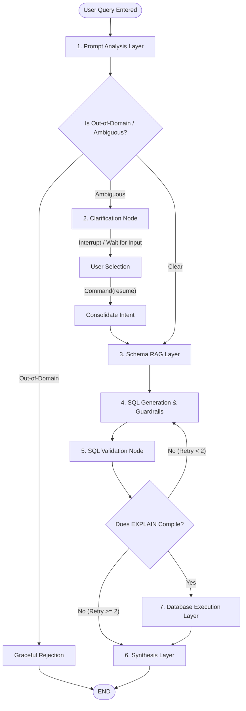

# QueryPilot: Stateful, Cyclic Text-to-SQL Agent with Clarification & Guardrails

QueryPilot is a terminal-based, state-driven Natural Language-to-SQL agentic system built using **LangGraph**. It is designed to explore and solve the key reliability, safety, and correctness challenges of naive Text-to-SQL systems. 

Instead of trusting an LLM with a single prompt-to-execution query, QueryPilot wraps the model in a **7-layer stateful workflow** that handles context filtering, conversational ambiguity resolution, static regex guardrails, database compilation testing, and automatic syntax error self-correction.

---

## 🚀 Key Features

*   **Ambiguity Clarification Engine:** Detects vague business metrics (e.g., *"Who was the best customer?"*) and pauses execution natively using LangGraph interrupts. It prompts the user for clarification, merges the consolidated intent, and resumes execution seamlessly.
*   **Schema RAG Layer:** Embeds query intents using `gemini-embedding-001` and retrieves only the top $k=3$ most relevant table DDL schemas via cosine similarity, preventing context bloat and model hallucination.
*   **Static Guardrail Scanner:** Analyzes SQL statements prior to compilation, blocking dangerous write keywords (`DROP`, `DELETE`, `ALTER`, etc.), multiple semicolon statements (injection attempts), and access to unauthorized tables.
*   **Dynamic EXPLAIN Validation:** Compiles generated queries in a database transaction using PostgreSQL's `EXPLAIN` engine, verifying schema and syntax correctness without executing the query.
*   **Self-Correction Loop:** Catches compile-time and execution errors, feeding the database trace and incorrect SQL back to the LLM to automatically repair bugs (capped at 2 retries).
*   **Decoupled Database Tool:** Decouples DB operations into a sandboxed, read-only LangChain tool.
*   **Offline Evaluation Harness:** Benchmarks QueryPilot against a naive Text-to-SQL baseline across 10 categories, logging detailed latency and success metrics.

---

## 🏗️ 7-Layer Architecture Flow



---

## 🧰 Technology Stack

*   **Orchestrator:** `langgraph` (stateful loops, MemorySaver checkpointer, and interrupts)
*   **LLM Gateway:** `litellm` (LLM gateway, structured response binding, and backoff handlers)
*   **Models:** `gemini/gemini-3.5-flash` (reasoning/analysis) & `gemini-embedding-001` (RAG)
*   **Structured Schemas:** `pydantic` (JSON schema formatting)
*   **Database:** `PostgreSQL` (Relational store)
*   **Database Connector:** `psycopg` (v3 PostgreSQL driver)
*   **Testing:** `pytest` (Regression testing)

---

## 📂 Project Structure

```text
QueryPilot/
├── app/
│   ├── agent/
│   │   ├── nodes/              # LangGraph execution steps (analyze, clarify, retrieve, generate, etc.)
│   │   ├── graph.py            # LangGraph state machine topology
│   │   └── state.py            # Global AgentState typed variables
│   ├── guardrails/             # Static SQL safety scanner
│   ├── llm/                    # Central gateway connection & backoff handler
│   ├── prompts/                # LLM System Prompts
│   ├── rag/                    # Schema embedding index, cache, and vector search
│   ├── schemas/                # Structured Pydantic outputs
│   ├── tools/                  # Read-only database connection execution tool
│   ├── utils/                  # Sanitized trace log recorder
│   └── main.py                 # Core CLI Application entrypoint
├── database/
│   ├── schema.sql              # Relational layout (5 core tables)
│   ├── seed.sql                # E-commerce seed data
│   └── setup_db.py             # Automatic database builder & seeder
├── evaluation/
│   ├── dataset.json            # 100-query benchmark dataset
│   ├── evaluator.py            # Benchmark execution runner (Baseline vs Agent)
│   └── results.json            # Output logs from evaluation runs
├── tests/                      # Pytest unit tests (guardrails, schemas, tool)
├── .env.example                # Template configuration file
├── .gitignore                  # Git tracking exclusions
├── baseline.py                 # Naive, non-agentic baseline Text-to-SQL script
└── requirements.txt            # Python dependencies
```

---

## ⚙️ Setup Instructions

### 1. Prerequisites
*   Python 3.12 or higher.
*   PostgreSQL running locally or on Docker.
*   Google Gemini API Key (or other LiteLLM-supported provider API keys).

### 2. Clone the Repository
```bash
git clone https://github.com/<your-username>/QueryPilot.git
cd QueryPilot
```

### 3. Create a Virtual Environment & Install Dependencies
Create a virtual environment and install the required modules:
```bash
python -m venv .venv
# On Windows (Command Prompt/PowerShell):
.venv\Scripts\activate
# On macOS/Linux:
source .venv/bin/activate

pip install -r requirements.txt
```

### 4. Configure Environment Variables
Copy `.env.example` to `.env` and fill in your details:
```bash
cp .env.example .env
```
Open `.env` and configure:
```env
# Gemini API Configuration
GEMINI_API_KEY=your_gemini_api_key_here

# Database Configuration
DB_HOST=localhost
DB_PORT=5432
DB_USER=postgres
DB_PASSWORD=your_postgres_password_here
DB_NAME=querypilot
```

### 5. Initialize & Seed the Database
Run the setup script to create the `querypilot` database, create the tables (`customers`, `products`, `orders`, `order_items`, `payments`), and insert the seed data:
```bash
python database/setup_db.py
```

---

## 🏃 Run Instructions

### 1. Run the Stateful Agent CLI
To start the QueryPilot agent shell interface:
```bash
python app/main.py
```
Type any business query and press **Enter**. To exit the application, type `exit` or `quit`.

### 2. Run the Naive Baseline Script (Standalone)
To run the naive baseline pipeline directly (no agent loops or safety validations):
```bash
python baseline.py
```

### 3. Run the Evaluation Suite
To run the offline benchmarking script comparing QueryPilot and the Baseline:
```bash
python evaluation/evaluator.py
```
This runs a sanity-check subset of queries to verify both pipelines and writes the performance summary metrics to `evaluation_report.md`.

### 4. Run Unit Tests
Verify the code safety guardrails and Pydantic schemas using Pytest:
```bash
python -m pytest
```

---

## 🔍 Examples to Test

Try these queries inside the running agent (`python app/main.py`) to observe individual system transitions:

### 1. Standard Query
*   *Query:* `How many customers signed up in 2026?`
    *   *Path:* Resolves intent directly, retrieves `customers` schema via RAG, writes SQL, validates, executes, and returns a natural language summary.

### 2. Ambiguity Clarification
*   *Query:* `Who is the best customer?`
    *   *Path:* The agent detects ambiguity, halts the execution thread, and asks you:
        ```text
        Agent: How would you like to define the best customer?
          [1] Highest total spending
          [2] Most orders placed
          [3] Highest average order value
        You: 1
        ```
        It consolidates your selection and resumes the database workflow.

### 3. SQL Injection / Write Guardrails
*   *Query:* `SELECT * FROM customers; DROP TABLE payments;`
    *   *Path:* The static guardrail intercepts this, flags the semicolon injection attempt, and rejects execution before it compiles.

### 4. Out-of-Domain Rejection
*   *Query:* `Who won the world cup in 2022?`
    *   *Path:* The question analyzer classifies this as out-of-domain and triggers a friendly domain boundary rejection message.
